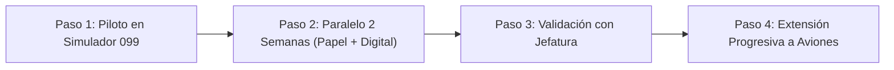

# Estudio y Propuesta: Digitalización del Aircraft Technical Log (e-ATL / eTLB)
**Escuela:** Blue Team Flight School  
**Elaborado para:** Presentación a Jefatura de Operaciones, CAMO y Dirección  
**Fecha:** Septiembre de 2026  
**Fase de Prueba Propuesta:** Simulador FSTD (`ES-3A-099` / `EN-1000x`)

---

## 1. Resumen Ejecutivo

El objetivo es modernizar la gestión de los partes de vuelo (ATL) sustituyendo progresivamente el papel por un sistema **e-ATL (Electronic Aircraft Technical Log)**. 

Para eliminar cualquier riesgo operativo o regulatorio inicial, la prueba piloto se propone en **el simulador (`ES-3A-099` / `EN-1000x`)**, el cual acumula el mayor volumen diario de sesiones y se encuentra en un entorno de tierra 100% controlado con alimentación eléctrica constante.

---

## 2. Respuesta a las Objeciones de Jefatura: ¿Cumple con la Normativa EASA / AESA?

### Objeción 1: *"La normativa exige que esté siempre a disposición de los tripulantes en la aeronave"*
* **¿Es real?**: Sí, la normativa (EASA Part-M.A.306 / Part-ML.A.306 y AMC 20-25 / AMC1 CAT.GEN.MPA.180 / NCO.GEN.135) exige que el libro técnico esté disponible a bordo para que la tripulación consulte el estado de la aeronave, revisiones pendientes, defectos diferidos y firme antes y después del vuelo.
* **¿Prohíbe EASA el formato digital?**: **En absoluto.** EASA contempla y aprueba explícitamente los sistemas **Electronic Technical Logbooks (eTLB)** y **Electronic Flight Bags (EFB)**. De hecho, prácticamente todas las aerolíneas europeas (Iberia, Vueling, Ryanair, Lufthansa) y las escuelas de vuelo modernas (FTEJerez, CAE, Oxford) operan con e-ATL desde hace años.

---

### Objeción 2: *"¿Qué pasa si la tablet se queda sin batería o se apaga?"*
EASA no exige que un sistema electrónico sea infalible por sí solo; exige un **Procedimiento de Contingencia y Disponibilidad (Contingency & Reliability Plan)** descrito en el Manual de Operaciones / CAME. En la industria aeronáutica, esto se resuelve con 3 capas estándar:

#### Capa 1: Redundancia de Dispositivos (BYOD - Bring Your Own Device)
* El sistema es una aplicación web responsiva y accesible desde cualquier navegador seguro.
* Si la tablet de cabina se apaga, **cualquier smartphone del instructor o alumno** (Android o iPhone) puede abrir el sistema al instante con sus credenciales y realizar la firma. Todos los pilotos llevan un teléfono móvil consigo.

#### Capa 2: Alimentación de Cabina y Powerbanks
* En aviación comercial y ejecutiva, las tablets de vuelo cuentan con cables de alimentación a las tomas USB de 12V/24V de la aeronave o powerbanks homologadas a bordo.
* Protocolo pre-vuelo: Verificación de un mínimo de carga de batería (típicamente ≥ 60%) antes de la salida, tal como especifica el AMC 20-25 de EASA para EFBs.

#### Capa 3: "Paper Contingency Kit" (Kit de Contingencia en Papel)
* Las aerolíneas y escuelas con e-ATL llevan siempre a bordo una funda con **3 a 5 hojas de papel de contingencia**.
* Si se produjera un fallo catastrófico simultáneo de todos los dispositivos y baterías, el vuelo se anota en la hoja de contingencia física y se vuelca al sistema al regresar a la base.

---

### Caso Especial: Simulador FSTD (`ES-3A-099` / `EN-1000x`)
Para el simulador, **la objeción de la batería queda completamente descartada**:
1. **Entorno fijo:** El simulador está conectado de forma ininterrumpida a la red eléctrica de 220V en las instalaciones de la escuela.
2. **Conexión garantizada:** Dispone de red Wi-Fi / cable local constante.
3. **Marco regulatorio:** Los FSTD se rigen por la normativa de dispositivos de simulación (CS-FSTD A / Part-ORA.FSTD), donde no aplican los requisitos de aeronavegabilidad en ruta (Part-ML en vuelo). Por tanto, la autorización interna de la escuela para digitalizar el log del simulador es directa e inmediata.

---

## 3. ¿Cómo lo hace la Industria? (Aerolíneas y Escuelas de Vuelo)

| Operador / Escuela | Solución e-ATL / EFB | Gestión de Batería y Contingencia |
| :--- | :--- | :--- |
| **Aerolíneas Comerciales** *(Iberia, Vueling, Ryanair, Lufthansa)* | iPad / Tablet instalada en soporte EFB clase 2, conectada a servidores de mantenimiento (Boeing ONS, Airbus Flysmart, Conduce eTLB). | Tomas USB fijas en cockpit + tablet del copiloto de backup + 3 hojas de papel de contingencia en carpeta de vuelo. |
| **Grandes Escuelas de Vuelo (ATOs)** *(FTEJerez, CAE, L3Harris, European Flyers)* | Software de operaciones y gestión de flota en tablets / terminales de briefing en base. | Tablets fijadas o tablets de briefing en sala de operaciones; registro antes de subir al avión o nada más aterrizar en plataforma. |
| **Aviación General / Escuelas Medias** | Soluciones cloud como FlightLogger, AirNav, ForeFlight Logbook o desarrollo interno web. | Instructores firman desde tablet de vuelo o smartphone con PIN personal y trazo táctil. |

---

## 4. El Sistema de Firma Digital para Instructores y Alumnos

Para garantizar validez y no repudio legal:

1. **Identificación Unívoca del Instructor:**
   * Nombre completo y dos apellidos.
   * Nº de Licencia oficial EASA (ej. `EASA.FCL.ESP.CPL.12345` con habilitación `FI(A)`).
   * Teléfono y correo institucional.
2. **Mecanismo de Doble Verificación (Firma Híbrida):**
   * **Trazo manuscrito en pantalla:** Firma visual en lienzo táctil (con dedo o stylus), idéntica a la firma en papel para inspecciones visuales rápidas.
   * **PIN de seguridad personal (4-6 dígitos):** Actúa como firma electrónica simple/avanzada. Al teclear el PIN, el sistema valida la identidad del instructor.
3. **Inmutabilidad y Sellado de Tiempo (Timestamp):**
   * Se registra la fecha y hora UTC exacta de la firma.
   * Se genera un **Hash criptográfico (SHA-256)** que sella la hoja. Si alguien intentara cambiar un minuto o un dato a posteriori, el sistema alertaría de que el documento ha sido alterado.
   * Cualquier corrección posterior requiere una "Enmienda de Rectificación" con firma obligatoria, tal como exige EASA.

---

## 5. Estrategia de Prueba Propuesta: Simulador `ES-3A-099` / `EN-1000x`

Proponemos a la Jefatura iniciar la digitalización exclusivamente en el **Simulador (`ES-3A-099`)**:

### ¿Por qué empezar con el Simulador?
* **Volumen más alto:** Es la máquina que más horas y rotaciones de alumnos realiza a la semana.
* **Cero riesgo de batería o cobertura:** Electricidad y Wi-Fi 100% estables.
* **Validación de instructores:** Permite que todos los instructores se familiaricen con el proceso de firma digital sin estrés de cabina.
* **Fórmula de tiempos validada:** Comprobar que los cálculos automáticos de tiempo de sesión y acumulados coinciden al segundo con las hojas físicas.

---

## 6. Próximos Pasos

1. Revisar este documento con el Jefe de Operaciones / Responsable de Mantenimiento.
2. Acordar la prueba piloto en el simulador `ES-3A-099`.
3. Una vez recibida la autorización de jefatura, implementaremos el módulo interactivo de cumplimentación y firma digital en la suite web actual.
